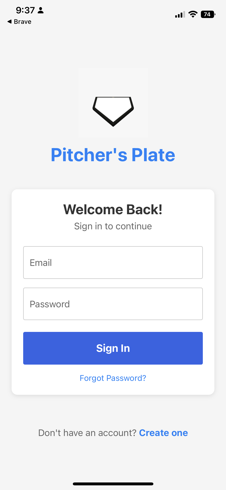
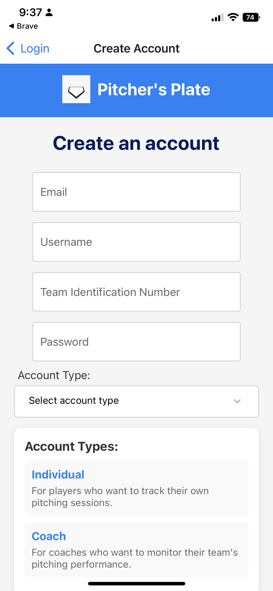
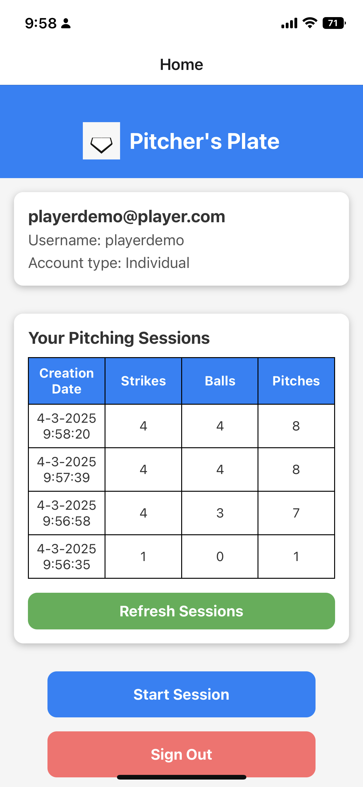
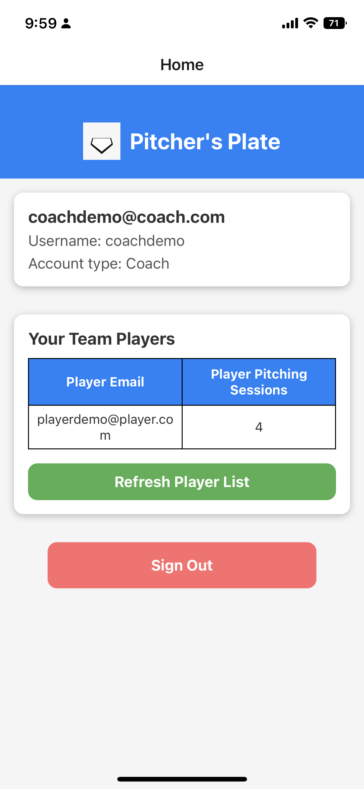
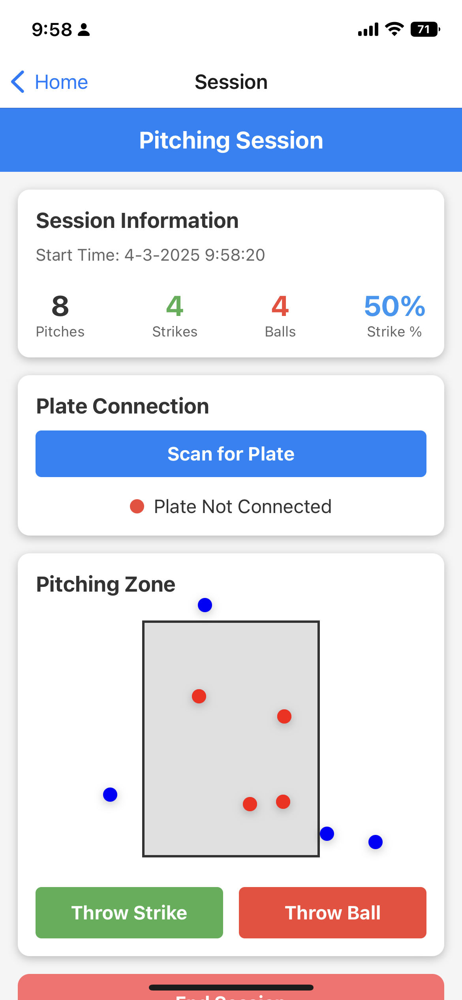

# Pitcher's Plate

A React Native Expo application for baseball pitchers and coaches to track pitching sessions and performance.
This was created for my capstone project for my Senior Design class at the University of Iowa.
I was the sole developer for this project.

My team and I entered the Innovation Challenge put on by the University of Iowa John Pappajohn Entrepreneurial Center and were given $5,000 in funding for 1st Place in the Best Active Lifestyle Business category.
Source: https://iowajpec.org/news/2022/04/s5g-earns-25k-innovation-challenge-awards-event

## Overview

Pitcher's Plate is a mobile application designed to help baseball pitchers track their pitching sessions and for coaches to monitor their team's performance. The app provides a simple and intuitive interface for recording pitches, tracking strikes and balls, and visualizing pitch locations.


## Features

### For Individual Players
- Create and manage pitching sessions
- Track strikes, balls, and total pitches
- Visualize pitch locations in the strike zone
- View historical pitching session data
- Connect to a physical plate device via Bluetooth (future feature)

### For Coaches
- Monitor all players on your team
- View player pitching statistics
- Track team performance over time
- Provide feedback to players (future feature)

## Technology Stack

- React Native with Expo
- Firebase Authentication
- Firestore Database
- React Navigation

## Installation

1. Clone the repository:
```
git clone https://github.com/yourusername/Pitchers_Plate.git
cd Pitchers_Plate
```

2. Install dependencies:
```
npm install
```

3. Set up Firebase configuration:
```
cp firebase.config.template.js firebase.config.js
```
Then edit `firebase.config.js` with your Firebase project credentials.

4. Start the Expo development server:
```
npx expo start
```

5. Use the Expo Go app on your mobile device to scan the QR code, or run on an emulator.

## Usage

### Account Creation
1. Create an account as either an "Individual" (player) or "Coach"
2. Enter your team identification number to connect with your team

### For Players
1. Log in to your account
2. View your past pitching sessions on the home screen
3. Start a new pitching session
4. Record strikes and balls during your session
5. End the session to save your data

### For Coaches
1. Log in to your account
2. View all players on your team
3. Monitor player statistics and performance

## Project Structure

- `/screens` - Main application screens
- `/components` - Reusable UI components
- `/assets` - Images and other static assets
- `/utils` - Utility functions and helpers
- `firebase.js` - Firebase initialization
- `firebase.config.js` - Firebase configuration (gitignored)
- `firebase.config.template.js` - Template for Firebase configuration

## Future Enhancements

- Advanced statistics and analytics
- Video recording and analysis
- Pitch velocity tracking
- Training recommendations based on performance
- Team management features for coaches
- Scheduling and calendar integration

## UI Screenshots

Here are some screenshots of the application's user interface:

### Login and Account Creation
<div style="display: flex; flex-direction: row;">
  
  
</div>

### Home Screens
<div style="display: flex; flex-direction: row;">
  
  
</div>

### Pitching Session


## License

This project is licensed under the MIT License - see the LICENSE file for details.
